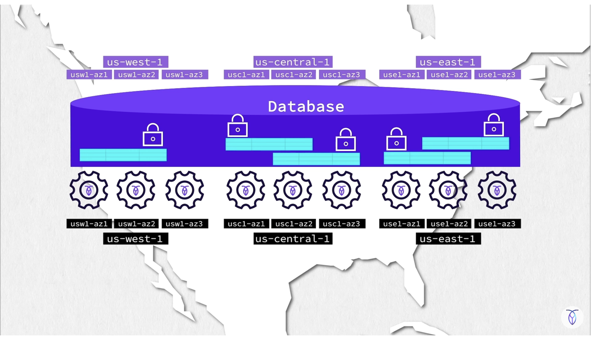

## CockroachDB - Locally Deployed as a multi node cluster, as part of a larger explore.

Welcome back to [The Rabbit Hole](https://medium.com/@georgelza/list/the-rabbit-hole-0df8e3155e33)

This all started with me exploring [CockroachDB by Cockroach Labs](https://www.cockroachlabs.com) as a in placement replacement for [PostgreSQL](https://www.postgresql.org), with higher availibility/scalability in mind for a critical banking use case. 

Now yes we can make PostgreSQL also very highly available (using Sharding and Read Replica's), but it takes more work, where as with CockroachDB it comes natively, naturally.

Now, before I get flamed, CockroachDB (also shorthand referred to as CRDB) is wire protocol compatible with PostgreSQL, it's not a 1 to 1 replacement. There are differences, and honestly, there always are. It will be for everyone that considers this to explore those differences as a Cost vs the benefit of the easy scale out of CockroachDB, added to the multi server, multi region replication and data placement / locality aware capabilities of CockroachDB.

Now, full disclosure, some of the diagrams, and examples below come from [Cockroach Labs](https://www.cockroachlabs.com), some of it as extracts accross various blogs, YouTube videos I've watched.

First, we'll just "play" with CRDB in a single node, just to get familiar with CRDB and then I'm going to simulate some clusters, 

- the first being just a simple 6 node cluster, where we always want 3 copies of our data.
- the second being a 6 node cluster, but we they are now 3 nodes at one Cloud provider and 3 at a second cloud provider.

Let's go.

All the code for this little explore can be found at [georgelza/cockroachdb_cluster_explore_1.git](https://github.com/georgelza/cockroachdb_cluster_explore_1.git)

## First, lets just look at a Single Node

I work on Apple MAC, so we use `homebrew` to install software, which is executed using the command `brew`.

```bash
brew install cockroachdb/tap/cockroach

# Once installed we can execute the following command to bring up a insecure single node. 
cockroach start-single-node --insecure --listen-addr=localhost:26257 --http-addr=localhost:8080
```

**Console Access**

Open Browser interface and Navigate to: localhost:8080

Now the below steps are from [Cockroach Labs](https://learn.cockroachlabs.com/page/on-demand-courses) amazing online training.

```bash
# Load dummy data,
cockroach workload init movr

#connect using SQL
cockroach sql --insecure
```

```sql
show databases;

show tables from movr;

select * from movr.users limit 10;

create database crdb_init;

set database = crdb_init;
-- or 
use crdb_init;

create table students (id UUID Primary KEY Default gen_random_uuid(), name string);

show create table students;

create table courses (sys_id UUID Default gen_random_uuid(), course_id INT, name string, Primary KEY (sys_id, course_id));

show create table courses;

-- Alter table courses add column schedule string;

show indexes from students;

select * from users where id=1;

explain select * from users where id=1;

create index my_index on users (last_name, first_name);

show indexes from users;
```

Ok, we've done the basics, now lets level up a bit here.


## Data Replication

A Cluster means nothing if it is just a set of nodes. Clusters are created to answer a specific requirement, namely: RAS (Reliability, availability, scalability), so lets go.


### Level - Easy, Simply Replicate


First, a concept, Replication factor, well, this simply means we want multiple copies of each block of data, a.k.a. replica's.

First CockroachDB, specifies as a best practice, to always use replication factor=3, as a mininum.

This simply mean, you need minimum 3 nodes, which implies each node will have a copy of every record. If you have more nodes, well then we start getting to the point where data is distributed evenly across the available nodes. And well this is the first, simplest configuration.

**Our nodes would look something like:**

```bash
# Node 1 Example
docker run -d \
  --name=roach1 \
  --hostname=roach1 \
  --net=roachnet \
  -p 26257:26257 \
  -p 8080:8080 \
  -v "./data/roach1:/cockroach/cockroach-data" \
  -v "./sql:/cockroach/sql:ro" \
  cockroachdb/cockroach:latest-v25.2 start \
    --advertise-addr=roach1:26357 \
    --http-addr=roach1:8080 \
    --listen-addr=roach1:26357 \
    --sql-addr=roach1:26257 \
    --insecure \
    --join=roach1:26357,roach2:26357,roach3:26357,roach4:26357,roach5:26357,roach6:26357
```

And we configure our cluster, specifying how we want the data replicated. In this case, we're simply saying we want 3 copies across the available cluster nodes.

```sql
ALTER RANGE default CONFIGURE ZONE USING
  num_replicas = 3;
```

### Level - Fantastic, Replicate and Distribute

Now CRDB's super power. You can tag your nodes, lets imagine you have 3 racks, and you're building a 9 node cluster (each rack will have 3 nodes installed in it). 

In this circumstance if we just specified replication factor of 3 as per previously (best practice) we can get into the situation where all 3 replica's of our data is in the same rack... So how do we protect ourself from that, and this is where we get to the below.

Well, when we create our nodes we now additionally specify the location for each node by using the `locality` property which takes a key:value string.

- For Node 1, 4 and 7
`--locality=rack=1`

- For Node 2, 5 and 8
`--locality=rack=2`

- For Node 3, 6 and 9
`--locality=rack=3`

**Our nodes definitions would look something like:**

```bash
# Node 1, see --locality=rack=1
docker run -d \
  --name=roach1 \
  --hostname=roach1 \
  --net=roachnet \
  -p 26257:26257 \
  -p 8080:8080 \
  -v "./data/roach1:/cockroach/cockroach-data" \
  -v "./sql:/cockroach/sql:ro" \
  cockroachdb/cockroach:latest-v25.2 start \
    --advertise-addr=roach1:26357 \
    --http-addr=roach1:8080 \
    --listen-addr=roach1:26357 \
    --sql-addr=roach1:26257 \
    --insecure \
    --locality=rack=1 \
    --join=roach1:26357,roach2:26357,roach3:26357,roach4:26357,roach5:26357,roach6:26357
```

```bash
# Node 2, see --locality=racke=2
docker run -d \
  --name=roach2 \
  --hostname=roach2 \
  --net=roachnet \
  -p 26258:26257 \
  -p 8081:8080 \
  -v "./data/roach2:/cockroach/cockroach-data" \
  -v "./sql:/cockroach/sql:ro" \
  cockroachdb/cockroach:latest-v25.2 start \
    --advertise-addr=roach2:26357 \
    --http-addr=roach2:8080 \
    --listen-addr=roach2:26357 \
    --sql-addr=roach2:26257 \
    --insecure \
    --locality=rack=2 \
    --join=roach1:26357,roach2:26357,roach3:26357,roach4:26357,roach5:26357,roach6:26357
```

And we configure our cluster, specifying how we want the data replicated. In this case, one copy in each rack.

```sql
-- Again we say we want 3 replica's, but we now also say rack 1 must have 1 copy, rack 2 must have 1 and rack 3 must have 1
ALTER RANGE default CONFIGURE ZONE USING
  num_replicas = 3,
  constraints = '{"+rack=1": 1, "+rack=2": 1, "+rack=3": 1}';
```

### Level - Amazing, Replicate and Geo Distribute

Now, imagine if we had agreement with two cloud providers and we wanted cluster distributed/stretched, say across AWS and Google, each having 3 physical locations, what AWS call Availibility Zones (AZ's) and what Google calls Zone, we'll go with zone...

We start, again by specifying the `locality` configuration for each node, but this time you will notice we have 3 key:value pairs defined:

- CP, Cloud Provider
- region, Region of the data centers
- zone, Zone as Google calls it, AZ as AWS calls it, basically the data center grouping.

*locality setting of our 6 cluster nodes, we can easily change this to 12, and have 2 nodes per local*

- For AWS - az1 nodes
`--locality=CP=aws,region=af-south-1,zone=az1`

- For AWS - az2 nodes
`--locality=CP=aws,region=af-south-1,zone=az2`

- For AWS - az3 nodes
`--locality=CP=aws,region=af-south-1,zone=az3`

- For Google - us-east1-b nodes
`--locality=CP=google,region=us-east1,zone=us-east1-b`

- For Google - us-east1-c nodes
`--locality=CP=google,region=us-east1,zone=us-east1-c`

- For Google - us-east1-d nodes
`--locality=CP=google,region=us-east1,zone=us-east1-d`

**Our nodes definitions would look something like:**

```bash
#0.node_1.sh
docker run -d \
  --name=roach1 \
  --hostname=roach1 \
  --net=roachnet \
  -p 26257:26257 \
  -p 8080:8080 \
  -v "./data/roach1:/cockroach/cockroach-data" \
  -v "./sql:/cockroach/sql:ro" \
  cockroachdb/cockroach:latest-v25.2 start \
    --advertise-addr=roach1:26357 \
    --http-addr=roach1:8080 \
    --listen-addr=roach1:26357 \
    --sql-addr=roach1:26257 \
    --insecure \
    --locality=CP=aws,region=af-south-1,zone=az1 \
    --join=roach1:26357,roach2:26357,roach3:26357,roach4:26357,roach5:26357,roach6:26357
```

Or, below in `docker-compose.yaml` format

```yaml
  roach1:
    image: cockroachdb/cockroach:latest-v25.2
    hostname: roach1
    container_name: roach1
    networks:
      - roachnet
    ports:
      - "26257:26257"   # host:container — SQL
      - "8080:8080"     # host:container — Admin UI
    volumes:
      - ./data/roach1:/cockroach/cockroach-data
      - ./sql:/cockroach/sql:ro
    command: >
      start
      --advertise-addr=roach1:26357
      --http-addr=roach1:8080
      --listen-addr=roach1:26357
      --sql-addr=roach1:26257
      --insecure
      --locality=CP=aws,region=af-south-1,zone=az1
      --join=roach1:26357,roach2:26357,roach3:26357,roach4:26357,roach5:26357,roach6:26357
```

And we configure our cluster, specifying how we want the data replicated. In the below, we define that we want at least one copy of our data in AWS and one copy in Google. We can go more prescriptive at cluster level by specifying region and/or zone also, which makes sense for a larger cluster, or less Region/Zone's defined.

```sql
-- Again we stay we want 3 replica's, but we now say at least one must be in CP=aws and one in CP=google, and well, the 3rd can be in either.
ALTER RANGE default CONFIGURE ZONE USING
  num_replicas = 3,
  constraints = '{"+CP=aws": 1, "+CP=google": 1}';
```

## Cluster Build time

Lets now see what we can get simulated locally...

Ok, so that was the easy version, the dip the toes into the water as the saying goes. We created a local single instance. But we want more, we want that cluster, we want to configure nodes as distributed, we want to define the locality of our data and the replication factor of the nodes. Ye, we want it all.

For the cluster build, I've provided 2 sets of scripts, 

1. Docker based, using indvidual scripts, see the `docker` sub directory

2. Docker Compose based, using a single `Makefile` paired with a `docker-compose.yaml`, see the `compose` sub directory

### Docker Build

```bash
cd docker
./0.network.sh
./1.node_1.sh
./2.node_2.sh
./3.node_3.sh
./4.node_4.sh
./5.node_5.sh
./6.node_6.sh
./7.init.sh
./8.ha_proxy.sh
```

After executing the above 8 scripts we will have a 6 node CockroachDB cluster, where we can connect directly to a specified node using the below command.

```bash
docker exec -it roach1 ./cockroach sql --host=roach1:26257 --insecure
# or by executing
./9.sql_connect.sh
```

or we can access our custer via [HAProxy](https://www.haproxy.org) service (which acts as a load balancer). 

Now, regarding the below, we're using `sql` cli client located on `roach1` to first query haproxy:26000 as specified by `--host=haproxy:26000` which then return a node name:port to which the client then connects, or, you could also install say [DBeaver](https://dbeaver.io) database GUI and then create a new target database, for which you then specify the host as `localhost:26000`

```bash
docker exec -it roach1 ./cockroach sql --insecure --host=haproxy:26000
```

I've placed 2 sql scripts in the local `docker/sql` directory which is mounted into our 6 x containers into `/cockroach/sql`. These can be executed in the above cockroach sql terminal we opened above using the below syntax:

```sql
\i /cockroach/sql/create_banks.sql
-- or
\i /cockroach/sql/demog.sql
```

Alternatively, you can connect to the container by executing `10.shell_connect.sh` which will place you in a bash terminal inside the running container,
followed by opening the `cockroach sql` utility by executing `./cockroach sql --host=roach1:26257 --insecure < /cockroach/sql/demog.sql`, which will pipe the contents of demog.sql into the sql cli.


### Docker Compose Build

And the below, does what the 8 scripts above did, and a bit more.

```bash
cd compose
make run
```


*Note*, you will notice from the `docker-compose.yaml` file that as part of the `roach-init` service, which calls `init_db.sh`, we're not only initializing our cluster, but we're also calling a sql script, `init_db.sql`, which creates a database named `demog` and 2 tables (`accountholders` and `transactions`), just as an example of how to bootstrap our environment a bit more, completely. 


### List Cluster nodes

```bash
# connect to our cluster, using cockroach sql cli
./9.sql_connect.sh

# or if you executed docker-compose build
make crsql
```

```sql
SELECT * FROM crdb_internal.gossip_nodes;

                                                         
  node_id | network |   address    | advertise_address | sql_network | sql_address  | advertise_sql_address | attrs |                 locality                  | cluster_name | server_version | build_tag |         started_at         | is_live | ranges | leases
----------+---------+--------------+-------------------+-------------+--------------+-----------------------+-------+-------------------------------------------+--------------+----------------+-----------+----------------------------+---------+--------+---------
        1 | tcp     | roach1:26357 | roach1:26357      | tcp         | roach1:26257 | roach1:26257          | []    | CP=aws,region=af-south-1,zone=az1          |              | 25.2           | v25.2.13  | 2026-03-08 14:47:36.808961 |    t    |     62 |     14
        2 | tcp     | roach2:26357 | roach2:26357      | tcp         | roach2:26257 | roach2:26257          | []    | CP=aws,region=af-south-1,zone=az2          |              | 25.2           | v25.2.13  | 2026-03-08 14:47:38.760356 |    t    |     62 |     13
        3 | tcp     | roach4:26357 | roach4:26357      | tcp         | roach4:26257 | roach4:26257          | []    | CP=google,region=us-east1,zone=us-east1-b |              | 25.2           | v25.2.13  | 2026-03-08 14:47:38.766291 |    t    |     61 |     12
        4 | tcp     | roach3:26357 | roach3:26357      | tcp         | roach3:26257 | roach3:26257          | []    | CP=aws,region=af-south-1,zone=az3          |              | 25.2           | v25.2.13  | 2026-03-08 14:47:38.766723 |    t    |     63 |     14
        5 | tcp     | roach5:26357 | roach5:26357      | tcp         | roach5:26257 | roach5:26257          | []    | CP=google,region=us-east1,zone=us-east1-c |              | 25.2           | v25.2.13  | 2026-03-08 14:47:38.771678 |    t    |     61 |     11
        6 | tcp     | roach6:26357 | roach6:26357      | tcp         | roach6:26257 | roach6:26257          | []    | CP=google,region=us-east1,zone=us-east1-d |              | 25.2           | v25.2.13  | 2026-03-08 14:47:38.771079 |    t    |     61 |     12
(6 rows)

Time: 3ms total (execution 2ms / network 1ms)

root@roach1:26257/demog>   
```


**Results in a Cluster:**

```
Node        CP          Region      Zone

roach1      aws         af-south-1  az1
roach2      aws         af-south-1  az2
roach3      aws         af-south-1  az3
roach4      google      us-east1    us-east1-b
roach5      google      us-east1    us-east1-c
roach6      google      us-east1    us-east1-d
```

With the above we get to the point where we can build a single database that looks/distributed something like the following diagram (All credit to Cockroach Labs for this).




## Data Placement Example

Now more magic. Let's create a geographical distributed table, with data locality rules applied.
You would have noticed that in both the docker and docker-compose examples our `--locality` property had a little bit more than just a single key:value pair specified.

What we're going to now do below is create a table, and pin the data based on a column value, namely `country=za` or `country=us`, all ZA data will be located in our AWS nodes and all US data will be placed on our Google located nodes.

```sql
-- 1. Create the Table
CREATE TABLE person (
    id          UUID          NOT NULL DEFAULT gen_random_uuid(),
    first_name  VARCHAR(100)  NOT NULL,
    last_name   VARCHAR(100)  NOT NULL,
    email       VARCHAR(255),
    phone       VARCHAR(50),

    -- Address fields
    street      VARCHAR(255),
    city        VARCHAR(100),
    state       VARCHAR(100),
    postal_code VARCHAR(20),
    country     VARCHAR(2)    NOT NULL,   -- ISO-3166 alpha-2: 'ZA', 'US', etc.

    created_at  TIMESTAMPTZ   NOT NULL DEFAULT now(),
    updated_at  TIMESTAMPTZ   NOT NULL DEFAULT now(),

    PRIMARY KEY (country, id)           -- country MUST be part of the PK for partitioning
);
-- 2. Partition the Table by Country
ALTER TABLE person PARTITION BY LIST (country) (
    PARTITION za VALUES IN ('ZA'),
    PARTITION us VALUES IN ('US'),
    PARTITION other VALUES IN (DEFAULT)
);

-- 3. Pin Partitions to Regions via Zone Configs
-- ZA data → af-south-1 (your AWS nodes)
ALTER PARTITION za OF TABLE person
    CONFIGURE ZONE USING
        num_replicas = 3,
        constraints  = '[+region=af-south-1]',
        lease_preferences = '[[+region=af-south-1]]';

-- US data → us-east1 (your Google nodes)
ALTER PARTITION us OF TABLE person
    CONFIGURE ZONE USING
        num_replicas = 3,
        constraints  = '[+region=us-east1]',
        lease_preferences = '[[+region=us-east1]]';

-- Everything else — no placement constraint, spread freely
ALTER PARTITION other OF TABLE person
    CONFIGURE ZONE USING
        num_replicas = 3;

-- 4. Do the Same for the Secondary Indexes
-- Every index on the table also needs to be partitioned, 
-- otherwise CockroachDB will store index data without placement constraints and your data residency guarantees break.
--
-- Example: index on email for lookups
CREATE INDEX idx_person_email ON person (country, email);  -- country prefix required

ALTER INDEX person@idx_person_email PARTITION BY LIST (country) (
    PARTITION za VALUES IN ('ZA'),
    PARTITION us VALUES IN ('US'),
    PARTITION other VALUES IN (DEFAULT)
);

ALTER PARTITION za OF INDEX person@idx_person_email
    CONFIGURE ZONE USING constraints = '[+region=af-south-1]',
                         lease_preferences = '[[+region=af-south-1]]';

ALTER PARTITION us OF INDEX person@idx_person_email
    CONFIGURE ZONE USING constraints = '[+region=us-east1]',
                         lease_preferences = '[[+region=us-east1]]';

```

### Lets check everything is working

```sql
-- Check partition definitions
SHOW PARTITIONS FROM TABLE person;
```

```                                                                                  
  database_name | table_name | partition_name | parent_partition | column_names |       index_name        | partition_value |                 zone_config                  |               full_zone_config
----------------+------------+----------------+------------------+--------------+-------------------------+-----------------+----------------------------------------------+-----------------------------------------------
  demog         | person     | other          | NULL             | country      | person@idx_person_email | (DEFAULT)       | NULL                                         | range_min_bytes = 134217728,
                |            |                |                  |              |                         |                 |                                              | range_max_bytes = 536870912,
                |            |                |                  |              |                         |                 |                                              | gc.ttlseconds = 14400,
                |            |                |                  |              |                         |                 |                                              | num_replicas = 3,
                |            |                |                  |              |                         |                 |                                              | constraints = '{+CP=aws: 1, +CP=google: 1}',
                |            |                |                  |              |                         |                 |                                              | lease_preferences = '[]'
  demog         | person     | other          | NULL             | country      | person@person_pkey      | (DEFAULT)       | num_replicas = 3                             | range_min_bytes = 134217728,
                |            |                |                  |              |                         |                 |                                              | range_max_bytes = 536870912,
                |            |                |                  |              |                         |                 |                                              | gc.ttlseconds = 14400,
                |            |                |                  |              |                         |                 |                                              | num_replicas = 3,
                |            |                |                  |              |                         |                 |                                              | constraints = '[]',
                |            |                |                  |              |                         |                 |                                              | lease_preferences = '[]'
  demog         | person     | us             | NULL             | country      | person@idx_person_email | ('US')          | constraints = '[+region=us-east1]',          | range_min_bytes = 134217728,
                |            |                |                  |              |                         |                 | lease_preferences = '[[+region=us-east1]]'   | range_max_bytes = 536870912,
                |            |                |                  |              |                         |                 |                                              | gc.ttlseconds = 14400,
                |            |                |                  |              |                         |                 |                                              | num_replicas = 3,
                |            |                |                  |              |                         |                 |                                              | constraints = '[+region=us-east1]',
                |            |                |                  |              |                         |                 |                                              | lease_preferences = '[[+region=us-east1]]'
  demog         | person     | us             | NULL             | country      | person@person_pkey      | ('US')          | num_replicas = 3,                            | range_min_bytes = 134217728,
                |            |                |                  |              |                         |                 | constraints = '[+region=us-east1]',          | range_max_bytes = 536870912,
                |            |                |                  |              |                         |                 | lease_preferences = '[[+region=us-east1]]'   | gc.ttlseconds = 14400,
                |            |                |                  |              |                         |                 |                                              | num_replicas = 3,
                |            |                |                  |              |                         |                 |                                              | constraints = '[+region=us-east1]',
                |            |                |                  |              |                         |                 |                                              | lease_preferences = '[[+region=us-east1]]'
  demog         | person     | za             | NULL             | country      | person@idx_person_email | ('ZA')          | constraints = '[+region=af-south-1]',        | range_min_bytes = 134217728,
                |            |                |                  |              |                         |                 | lease_preferences = '[[+region=af-south-1]]' | range_max_bytes = 536870912,
                |            |                |                  |              |                         |                 |                                              | gc.ttlseconds = 14400,
                |            |                |                  |              |                         |                 |                                              | num_replicas = 3,
                |            |                |                  |              |                         |                 |                                              | constraints = '[+region=af-south-1]',
                |            |                |                  |              |                         |                 |                                              | lease_preferences = '[[+region=af-south-1]]'
  demog         | person     | za             | NULL             | country      | person@person_pkey      | ('ZA')          | num_replicas = 3,                            | range_min_bytes = 134217728,
                |            |                |                  |              |                         |                 | constraints = '[+region=af-south-1]',        | range_max_bytes = 536870912,
                |            |                |                  |              |                         |                 | lease_preferences = '[[+region=af-south-1]]' | gc.ttlseconds = 14400,
                |            |                |                  |              |                         |                 |                                              | num_replicas = 3,
                |            |                |                  |              |                         |                 |                                              | constraints = '[+region=af-south-1]',
                |            |                |                  |              |                         |                 |                                              | lease_preferences = '[[+region=af-south-1]]'
(6 rows)
```

```sql
-- Check zone configs
SHOW ZONE CONFIGURATION FOR PARTITION za OF TABLE person;
```

```
             target            |                     raw_config_sql
-------------------------------+----------------------------------------------------------
  PARTITION za OF TABLE person | ALTER PARTITION za OF TABLE person CONFIGURE ZONE USING
                               |     range_min_bytes = 134217728,
                               |     range_max_bytes = 536870912,
                               |     gc.ttlseconds = 14400,
                               |     num_replicas = 3,
                               |     constraints = '[+region=af-south-1]',
                               |     lease_preferences = '[[+region=af-south-1]]'
(1 row)
```

```sql
SHOW ZONE CONFIGURATION FOR PARTITION us OF TABLE person;
```

```
             target            |                     raw_config_sql
-------------------------------+----------------------------------------------------------
  PARTITION us OF TABLE person | ALTER PARTITION us OF TABLE person CONFIGURE ZONE USING
                               |     range_min_bytes = 134217728,
                               |     range_max_bytes = 536870912,
                               |     gc.ttlseconds = 14400,
                               |     num_replicas = 3,
                               |     constraints = '[+region=us-east1]',
                               |     lease_preferences = '[[+region=us-east1]]'
(1 row)
```

**Let insert some data**
```sql
INSERT INTO person (first_name, last_name, email, phone, street, city, state, postal_code, country)
VALUES
    -- 6 ZA rows → partition: za → AWS af-south-1
    ('Sipho',    'Dlamini',   'sipho.dlamini@example.co.za',   '+27-11-555-0101', '12 Mandela Street',      'Johannesburg', 'Gauteng',     '2000', 'ZA'),
    ('Thandi',   'Nkosi',     'thandi.nkosi@example.co.za',    '+27-21-555-0102', '4 Buitenkant Street',    'Cape Town',    'Western Cape','8001', 'ZA'),
    ('Bongani',  'Zulu',      'bongani.zulu@example.co.za',    '+27-31-555-0103', '88 Joe Slovo Drive',     'Durban',       'KwaZulu-Natal','4001','ZA'),
    ('Ayanda',   'Mokoena',   'ayanda.mokoena@example.co.za',  '+27-12-555-0104', '3 Church Street',        'Pretoria',     'Gauteng',     '0002', 'ZA'),
    ('Lerato',   'Sithole',   'lerato.sithole@example.co.za',  '+27-51-555-0105', '19 Aliwal Street',       'Bloemfontein', 'Free State',  '9301', 'ZA'),
    ('Kagiso',   'Mahlangu',  'kagiso.mahlangu@example.co.za', '+27-13-555-0106', '7 Kerk Street',          'Nelspruit',    'Mpumalanga',  '1200', 'ZA'),

    -- 4 US rows → partition: us → Google us-east1
    ('James',    'Carter',    'james.carter@example.com',      '+1-212-555-0201', '350 Fifth Avenue',       'New York',     'NY',          '10118','US'),
    ('Maria',    'Gonzalez',  'maria.gonzalez@example.com',    '+1-305-555-0202', '1200 Brickell Avenue',   'Miami',        'FL',          '33131','US'),
    ('Tyler',    'Brooks',    'tyler.brooks@example.com',      '+1-312-555-0203', '233 S Wacker Drive',     'Chicago',      'IL',          '60606','US'),
    ('Aisha',    'Washington','aisha.washington@example.com',  '+1-404-555-0204', '100 Peachtree Street NW','Atlanta',      'GA',          '30303','US');


--  After inserting rows, check replica placement**
SHOW RANGES FROM TABLE person WITH DETAILS;
```

```
        start_key       |      end_key       | range_id |       range_size_mb       | lease_holder |           lease_holder_locality           | replicas |                                                          replica_localities                                                           | voting_replicas | non_voting_replicas | learner_replicas |    split_enforced_until    | range_size |                                                                                                     span_stats
------------------------+--------------------+----------+---------------------------+--------------+-------------------------------------------+----------+---------------------------------------------------------------------------------------------------------------------------------------+-----------------+---------------------+------------------+----------------------------+------------+----------------------------------------------------------------------------------------------------------------------------------------------------------------------------------------------------------------------
  <before:/Table/107/4> | …/1/"US"           |       79 |                         0 |            1 | CP=aws,region=af-south-1,zone=az1         | {1,3,5}  | {"CP=aws,region=af-south-1,zone=az1","CP=google,region=us-east1,zone=us-east1-d","CP=aws,region=af-south-1,zone=az2"}                 | {3,1,5}         | {}                  | {}               | 2026-03-08 16:05:00.470498 |          0 | {"approximate_disk_bytes": 50254, "intent_bytes": 0, "intent_count": 0, "key_bytes": 0, "key_count": 0, "live_bytes": 0, "live_count": 0, "sys_bytes": 3030, "sys_count": 10, "val_bytes": 0, "val_count": 0}
  …/1/"US"              | …/1/"US"/PrefixEnd |       97 | 0.00067600000000000000000 |            3 | CP=google,region=us-east1,zone=us-east1-d | {3,4,6}  | {"CP=google,region=us-east1,zone=us-east1-d","CP=google,region=us-east1,zone=us-east1-c","CP=google,region=us-east1,zone=us-east1-b"} | {3,4,6}         | {}                  | {}               | NULL                       |        676 | {"approximate_disk_bytes": 18000, "intent_bytes": 0, "intent_count": 0, "key_bytes": 160, "key_count": 4, "live_bytes": 676, "live_count": 4, "sys_bytes": 769, "sys_count": 7, "val_bytes": 516, "val_count": 4}
  …/1/"US"/PrefixEnd    | …/1/"ZA"           |       98 |                         0 |            4 | CP=google,region=us-east1,zone=us-east1-c | {3,4,5}  | {"CP=google,region=us-east1,zone=us-east1-d","CP=google,region=us-east1,zone=us-east1-c","CP=aws,region=af-south-1,zone=az2"}         | {3,4,5}         | {}                  | {}               | NULL                       |          0 | {"approximate_disk_bytes": 30392, "intent_bytes": 0, "intent_count": 0, "key_bytes": 0, "key_count": 0, "live_bytes": 0, "live_count": 0, "sys_bytes": 400, "sys_count": 7, "val_bytes": 0, "val_count": 0}
  …/1/"ZA"              | …/1/"ZA"/PrefixEnd |       95 |  0.0010640000000000000000 |            2 | CP=aws,region=af-south-1,zone=az3         | {1,2,5}  | {"CP=aws,region=af-south-1,zone=az1","CP=aws,region=af-south-1,zone=az3","CP=aws,region=af-south-1,zone=az2"}                         | {2,1,5}         | {}                  | {}               | NULL                       |       1064 | {"approximate_disk_bytes": 59195, "intent_bytes": 0, "intent_count": 0, "key_bytes": 241, "key_count": 6, "live_bytes": 1064, "live_count": 6, "sys_bytes": 1142, "sys_count": 8, "val_bytes": 823, "val_count": 6}
  …/1/"ZA"/PrefixEnd    | …/2                |       96 |                         0 |            3 | CP=google,region=us-east1,zone=us-east1-d | {3,4,5}  | {"CP=google,region=us-east1,zone=us-east1-d","CP=google,region=us-east1,zone=us-east1-c","CP=aws,region=af-south-1,zone=az2"}         | {3,4,5}         | {}                  | {}               | NULL                       |          0 | {"approximate_disk_bytes": 30392, "intent_bytes": 0, "intent_count": 0, "key_bytes": 0, "key_count": 0, "live_bytes": 0, "live_count": 0, "sys_bytes": 437, "sys_count": 7, "val_bytes": 0, "val_count": 0}
  …/2                   | …/2/"US"           |       99 |                         0 |            3 | CP=google,region=us-east1,zone=us-east1-d | {3,4,5}  | {"CP=google,region=us-east1,zone=us-east1-d","CP=google,region=us-east1,zone=us-east1-c","CP=aws,region=af-south-1,zone=az2"}         | {3,4,5}         | {}                  | {}               | 2026-03-08 16:12:02.294434 |          0 | {"approximate_disk_bytes": 30392, "intent_bytes": 0, "intent_count": 0, "key_bytes": 0, "key_count": 0, "live_bytes": 0, "live_count": 0, "sys_bytes": 591, "sys_count": 7, "val_bytes": 0, "val_count": 0}
  …/2/"US"              | …/2/"US"/PrefixEnd |      103 | 0.00029400000000000000000 |            3 | CP=google,region=us-east1,zone=us-east1-d | {3,4,6}  | {"CP=google,region=us-east1,zone=us-east1-d","CP=google,region=us-east1,zone=us-east1-c","CP=google,region=us-east1,zone=us-east1-b"} | {3,4,6}         | {}                  | {}               | NULL                       |        294 | {"approximate_disk_bytes": 18000, "intent_bytes": 0, "intent_count": 0, "key_bytes": 274, "key_count": 4, "live_bytes": 294, "live_count": 4, "sys_bytes": 769, "sys_count": 7, "val_bytes": 20, "val_count": 4}
  …/2/"US"/PrefixEnd    | …/2/"ZA"           |      104 |                         0 |            3 | CP=google,region=us-east1,zone=us-east1-d | {3,4,5}  | {"CP=google,region=us-east1,zone=us-east1-d","CP=google,region=us-east1,zone=us-east1-c","CP=aws,region=af-south-1,zone=az2"}         | {3,4,5}         | {}                  | {}               | NULL                       |          0 | {"approximate_disk_bytes": 16545, "intent_bytes": 0, "intent_count": 0, "key_bytes": 0, "key_count": 0, "live_bytes": 0, "live_count": 0, "sys_bytes": 344, "sys_count": 6, "val_bytes": 0, "val_count": 0}
  …/2/"ZA"              | …/2/"ZA"/PrefixEnd |      101 | 0.00045300000000000000000 |            1 | CP=aws,region=af-south-1,zone=az1         | {1,2,5}  | {"CP=aws,region=af-south-1,zone=az1","CP=aws,region=af-south-1,zone=az3","CP=aws,region=af-south-1,zone=az2"}                         | {1,2,5}         | {}                  | {}               | NULL                       |        453 | {"approximate_disk_bytes": 59195, "intent_bytes": 0, "intent_count": 0, "key_bytes": 423, "key_count": 6, "live_bytes": 453, "live_count": 6, "sys_bytes": 1142, "sys_count": 8, "val_bytes": 30, "val_count": 6}
  …/2/"ZA"/PrefixEnd    | …/3                |      102 |                         0 |            3 | CP=google,region=us-east1,zone=us-east1-d | {3,4,5}  | {"CP=google,region=us-east1,zone=us-east1-d","CP=google,region=us-east1,zone=us-east1-c","CP=aws,region=af-south-1,zone=az2"}         | {3,4,5}         | {}                  | {}               | NULL                       |          0 | {"approximate_disk_bytes": 0, "intent_bytes": 0, "intent_count": 0, "key_bytes": 0, "key_count": 0, "live_bytes": 0, "live_count": 0, "sys_bytes": 339, "sys_count": 6, "val_bytes": 0, "val_count": 0}
  …/3                   | <after:/Max>       |      100 |                         0 |            3 | CP=google,region=us-east1,zone=us-east1-d | {3,4,5}  | {"CP=google,region=us-east1,zone=us-east1-d","CP=google,region=us-east1,zone=us-east1-c","CP=aws,region=af-south-1,zone=az2"}         | {3,4,5}         | {}                  | {}               | NULL                       |          0 | {"approximate_disk_bytes": 0, "intent_bytes": 0, "intent_count": 0, "key_bytes": 0, "key_count": 0, "live_bytes": 0, "live_count": 0, "sys_bytes": 405, "sys_count": 6, "val_bytes": 0, "val_count": 0}
(11 rows)
```


## Summary / Conclusion

- You can use CockroachDB to simply replicate data across multiple physical nodes to ensure data our previously mentioned concept RAS (Reliability, Scalability, Avalability), or

- You can use CockroachDB to do provide oyo with RAS while at the same time allowing you to define data placement to comply with things like data Governance, i.e. GDPR based, or performance (data closer to the specific user base). Note: For Geo pinned clusters, the tables critically dependant on the table partitioning, matching the cluster configuration, if you havent noticed.


CockroachDB, pretty amazing platform if you ask me, and we've just touched the surface. 


## THE END

And like that we’re done with our little trip down another Rabbit Hole, Till next time. 

Thanks for following. 


### The Rabbit Hole


### ABOUT ME

I’m a techie, a technologist, always curious, love data, have for as long as I can remember always worked with data in one form or the other, Database admin, Database product lead, data platforms architect, infrastructure architect hosting databases, backing it up, optimizing performance, accessing it. Data data data… it makes the world go round.
In recent years, pivoted into a more generic Technology Architect role, capable of full stack architecture.

### By: George Leonard

- georgelza@gmail.com
- https://www.linkedin.com/in/george-leonard-945b502/
- https://medium.com/@georgelza


