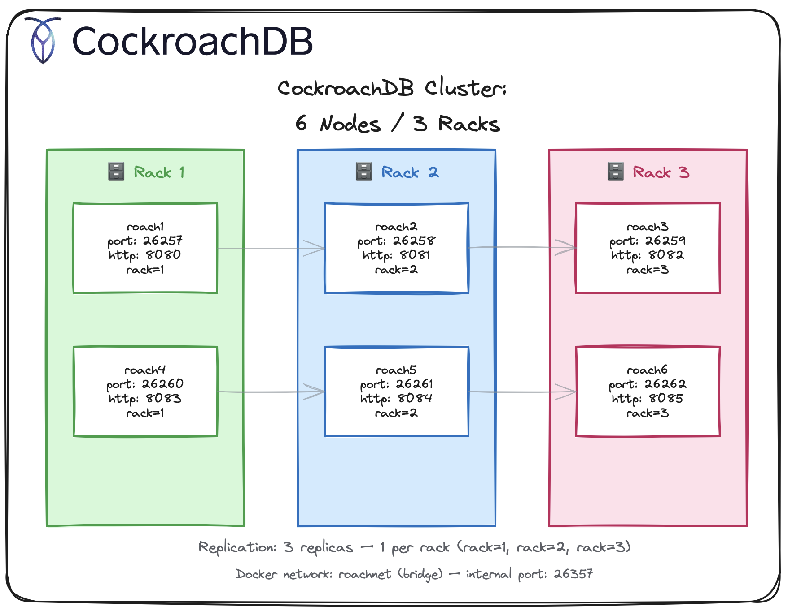
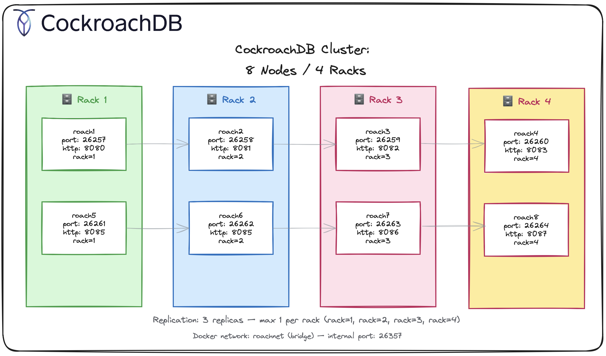
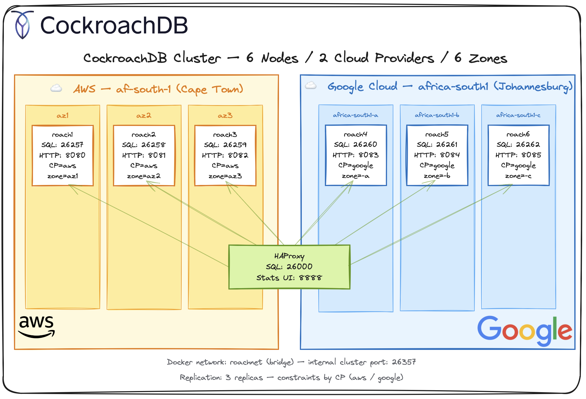

## CockroachDB - Locally Deployed as a multi node cluster, as part of a larger explore.

Welcome back to [The Rabbit Hole](https://medium.com/@georgelza/list/the-rabbit-hole-0df8e3155e33)

This all started with me exploring [CockroachDB by Cockroach Labs](https://www.cockroachlabs.com) as a in placement replacement for [PostgreSQL](https://www.postgresql.org), with higher availibility/scalability in mind for a critical banking use case. 

Now yes we can make PostgreSQL also very highly available (using Sharding and Read Replica's), but it takes more work, where as with CockroachDB it comes natively, naturally.

Now, before I get flamed, CockroachDB (also shorthand referred to as CRDB) is wire protocol compatible with PostgreSQL, it's not a 1 to 1 replacement. There are differences, and honestly, there always are. It will be for everyone that considers this to explore those differences as a Cost vs the benefit of the easy scale out of CockroachDB, added to the multi server, multi region replication and data placement / locality aware capabilities of CockroachDB.

Now, full disclosure, some of the diagrams, and examples below come from [Cockroach Labs](https://www.cockroachlabs.com), some of it as extracts accross various blogs, YouTube videos I've watched.

First, we'll just "play" with CRDB in a single node, just to get familiar with CRDB and then I'm going to simulate some clusters configurations.

I provide example scripts for 2 cluster examples, 

- a manual docker based pattern, deploying our cluster using individual scripts.
- then for the second example we're using a docker-compose based pattern.

Let's go.

All the code for this little explore can be found at [georgelza/cockroachdb_cluster_explore_1.git](https://github.com/georgelza/cockroachdb_cluster_explore_1.git)

## First, lets just look at a Single Node

I work on Apple MAC, so we use `homebrew` to install software, which is executed using the command `brew`.

```bash
brew install cockroachdb/tap/cockroach

# Once installed we can execute the following command to bring up a insecure single node. 
cockroach start-single-node --insecure --listen-addr=localhost:26257 --http-addr=localhost:8080
```

**Console Access**

Open Browser interface and Navigate to: localhost:8080

Now the below steps are from [Cockroach Labs](https://learn.cockroachlabs.com/page/on-demand-courses) amazing online training.

```bash
# Load dummy data,
cockroach workload init movr

#connect using SQL
cockroach sql --insecure
```

```sql
show databases;

show tables from movr;

select * from movr.users limit 10;

create database crdb_init;

set database = crdb_init;
-- or 
use crdb_init;

create table students (id UUID Primary KEY Default gen_random_uuid(), name string);

show create table students;

create table courses (sys_id UUID Default gen_random_uuid(), course_id INT, name string, Primary KEY (sys_id, course_id));

show create table courses;

-- Alter table courses add column schedule string;

show indexes from students;

select * from users where id=1;

explain select * from users where id=1;

create index my_index on users (last_name, first_name);

show indexes from users;
```

Ok, we've done the basics, now lets level up a bit here.


## Cluster Concepts:

A Cluster means nothing if it is just a set of nodes. Clusters are created to answer a specific requirement, namely: RAS (Reliability, availability, scalability), so lets go.

### Data Replication

First, a concept, Replication factor, well, this simply means we want multiple copies of each block of data, a.k.a. replica's.

First CockroachDB, specifies as a best practice, to always use replication factor=3, as a mininum.

This simply mean, you need minimum 3 nodes, which implies each node will have a copy of every record. If you have more nodes, well then we start getting to the point where data is distributed evenly across the available nodes. And well this is the first, simplest configuration.

### Data Distribution

With this we control where the data actually is actually placed, by incorporating the actual location of the nodes, configured using `--locality`.


## Cluster builds

### Level - Easy, Simply Replicate

So for our first example, we're just going to use replication, here we're using our `docker` based build, where we build 6 nodes, and specify we want 3 copies

**Our nodes would look something like:**

```bash
# Node 1 Example
docker run -d \
  --name=roach1 \
  --hostname=roach1 \
  --net=roachnet \
  -p 26257:26257 \
  -p 8080:8080 \
  -v "./data/roach1:/cockroach/cockroach-data" \
  -v "./sql:/cockroach/sql:ro" \
  cockroachdb/cockroach:latest-v25.2 start \
    --advertise-addr=roach1:26357 \
    --http-addr=roach1:8080 \
    --listen-addr=roach1:26357 \
    --sql-addr=roach1:26257 \
    --insecure \
    --join=roach1:26357,roach2:26357,roach3:26357,roach4:26357,roach5:26357,roach6:26357
```

And we configure our cluster, specifying how we want the data replicated. In this case, we're simply saying we want 3 copies across the available cluster nodes.

```sql
ALTER RANGE default CONFIGURE ZONE USING
  num_replicas = 3;
```

### Level - Super, Replicate and Distribute

Now CRDB's super power. You can tag your nodes. We can specify rboth eplication factor and locality, driving data placement and copies. Lets imagine you have 3 racks, and you're building a 9 node cluster (each rack will have 3 nodes installed in it). 

In this circumstance if we only specified replication factor of 3 as per above example (thus still following our best practice) we can get into the situation where all 3 replica's of our data is in the same rack... Not good. So how do we protect ourself from that, and this is where we get to `--locality=`.

For our 9 node cluster in our 3 racks, we now additionally specify `--locality=` for each node.

```
# For Nodes 1, 4 and 7
--locality=rack=1

# For Nodes 2, 5 and 8
--locality=rack=2

# For Nodes 3, 6 and 9
--locality=rack=3
```

**Our nodes definitions would look something like:**

```bash
# Node 1, see --locality=rack=1
docker run -d \
  --name=roach1 \
  --hostname=roach1 \
  --net=roachnet \
  -p 26257:26257 \
  -p 8080:8080 \
  -v "./data/roach1:/cockroach/cockroach-data" \
  -v "./sql:/cockroach/sql:ro" \
  cockroachdb/cockroach:latest-v25.2 start \
    --advertise-addr=roach1:26357 \
    --http-addr=roach1:8080 \
    --listen-addr=roach1:26357 \
    --sql-addr=roach1:26257 \
    --insecure \
    --locality=rack=1 \
    --join=roach1:26357,roach2:26357,roach3:26357,roach4:26357,roach5:26357,roach6:26357
```

```bash
# Node 2, see --locality=rack=2
docker run -d \
  --name=roach2 \
  --hostname=roach2 \
  --net=roachnet \
  -p 26258:26257 \
  -p 8081:8080 \
  -v "./data/roach2:/cockroach/cockroach-data" \
  -v "./sql:/cockroach/sql:ro" \
  cockroachdb/cockroach:latest-v25.2 start \
    --advertise-addr=roach2:26357 \
    --http-addr=roach2:8080 \
    --listen-addr=roach2:26357 \
    --sql-addr=roach2:26257 \
    --insecure \
    --locality=rack=2 \
    --join=roach1:26357,roach2:26357,roach3:26357,roach4:26357,roach5:26357,roach6:26357
```

Implying we have 3 nodes in 3 groupings, 3 in each rack.

And now we configure our cluster, telling it how we want the configure data distribution. In this case, one copy in each rack.

```sql
-- Again we say we want 3 replica's, but we now also say rack 1 must have 1 copy, rack 2 must have 1 and rack 3 must have 1
-- This seems expensive when we only have 3 nodes as each node have a copy, but once we upgrade to 6, 9, 12 nodes this becomes very attractive. 
-- It does imply we want to grow our cluster with 3 nodes every time.
ALTER RANGE default CONFIGURE ZONE USING
  num_replicas = 3,
  constraints = '{"+rack=1": 1, "+rack=2": 1, "+rack=3": 1}';
```




### Level - Awesome, Replicate and Distribute

Lets look at another pattern. We now have 4 nodes, located in 4 racks, and we still following the best practice of 3 replica's. 

Our nodes would have the `--locality=` configured as per below.

Node 1
`--locality=rack=1`
Node 2
`--locality=rack=2`
Node 3
`--locality=rack=3`
Node 4
`--locality=rack=4`

And now we configure our cluster, This is the easy version, ;) we simply configure it with num_replicas=3. This will drive a even distribution of our data across our 4 nodes in the 4 racks, as we build out our data set.

```sql
ALTER RANGE default CONFIGURE ZONE USING
  num_replicas = 3;
```

Lets level up a bit now. But, what happens when business sky rockets and we grow our cluster from 4 nodes to 8, other words 2 nodes per rack. We still want 3 copies, but never want to get into the situation where we have 2 copies/replica's to co-exist in the same rack. 

Our 8 nodes are configures as:

Node 1 and 5
`--locality=rack=1`
Node 2 and 6
`--locality=rack=2`
Node 3 and 7
`--locality=rack=3`
Node 4 and 8
`--locality=rack=4`

And now we configure our cluster, teling it how we want the distribution applied.

```sql
ALTER RANGE default CONFIGURE ZONE USING
  num_replicas = 3,
  constraints = '{"+rack1": 1, "+rack2": 1, "+rack3": 1, "+rack4": 1}';
```

CockroachDB interprets this as **at most 1 replica per rack** when the sum of constraints exceeds `num_replicas`. Since 4 > 3, it will place exactly 1 replica in 3 of the 4 racks, never 2 in the same rack. ✅




### Level - Amazing, Replicate and Distribute across Cloud Providers

Now, imagine if we had agreement with two cloud providers and we wanted cluster distributed/stretched, say across AWS and Google, each having 3 physical locations, what AWS call Availibility Zones (AZ's) and what Google calls Zone, we'll go with zone...

We start, again by specifying the `locality` configuration for each node, but this time you will notice we have 3 key:value pairs defined:

- CP, Cloud Provider
- region, Region of the data centers
- zone, Zone as Google calls it, AZ as AWS calls it, basically the data center grouping.

Our 6 nodes are now onfigured as:

- For AWS - az1 located nodes
`--locality=CP=aws,region=af-south-1,zone=az1`

- For AWS - az2 located nodes
`--locality=CP=aws,region=af-south-1,zone=az2`

- For AWS - az3 located nodes
`--locality=CP=aws,region=af-south-1,zone=az3`

- For Google - africa-south1-a located nodes
`--locality=CP=google,region=africa-south1,zone=africa-south1-a`

- For Google - africa-south1-b located nodes
`--locality=CP=google,region=africa-south1,zone=africa-south1-b`

- For Google - africa-south1-c located nodes
`--locality=CP=google,region=africa-south1,zone=africa-south1-c`

**Our nodes definitions would look something like:**

For these examples we'll be using our `docker-compose.yaml` deployment pattern, only showing nodes 1,2, 4 and 5

```yaml
  roach1:
    image: cockroachdb/cockroach:latest-v25.2
    hostname: roach1
    container_name: roach1
    networks:
      - roachnet
    ports:
      - "26257:26257"   # host:container — SQL
      - "8080:8080"     # host:container — Admin UI
    volumes:
      - ./data/roach1:/cockroach/cockroach-data
      - ./sql:/cockroach/sql:ro
    command: >
      start
      --advertise-addr=roach1:26357
      --http-addr=roach1:8080
      --listen-addr=roach1:26357
      --sql-addr=roach1:26257
      --insecure
      --locality=CP=aws,region=af-south-1,zone=az1
      --join=roach1:26357,roach2:26357,roach3:26357,roach4:26357,roach5:26357,roach6:26357
  roach2:
    image: cockroachdb/cockroach:latest-v25.2
    hostname: roach2
    container_name: roach2
    networks:
      - roachnet
    ports:
      - "26258:26257"   # host:container — SQL
      - "8081:8080"     # host:container — Admin UI
    volumes:
      - ./data/roach2:/cockroach/cockroach-data
      - ./sql:/cockroach/sql:ro
    command: >
      start
      --advertise-addr=roach2:26357
      --http-addr=roach2:8080
      --listen-addr=roach2:26357
      --sql-addr=roach2:26257
      --insecure
      --locality=CP=aws,region=af-south-1,zone=az2
      --join=roach1:26357,roach2:26357,roach3:26357,roach4:26357,roach5:26357,roach6:26357
  
  roach4:
    image: cockroachdb/cockroach:latest-v25.2
    hostname: roach4
    container_name: roach4
    networks:
      - roachnet
    ports:
      - "26260:26257"   # host:container — SQL
      - "8083:8080"     # host:container — Admin UI
    volumes:
      - ./data/roach4:/cockroach/cockroach-data
      - ./sql:/cockroach/sql:ro
    command: >
      start
      --advertise-addr=roach4:26357
      --http-addr=roach4:8080
      --listen-addr=roach4:26357
      --sql-addr=roach4:26257
      --insecure
      --locality=CP=google,region=africa-south1,zone=africa-south1-a
      --join=roach1:26357,roach2:26357,roach3:26357,roach4:26357,roach5:26357,roach6:26357

  roach5:
    image: cockroachdb/cockroach:latest-v25.2
    hostname: roach5
    container_name: roach5
    networks:
      - roachnet
    ports:
      - "26261:26257"   # host:container — SQL
      - "8084:8080"     # host:container — Admin UI
    volumes:
      - ./data/roach5:/cockroach/cockroach-data
      - ./sql:/cockroach/sql:ro
    command: >
      start
      --advertise-addr=roach5:26357
      --http-addr=roach5:8080
      --listen-addr=roach5:26357
      --sql-addr=roach5:26257
      --insecure
      --locality=CP=google,region=africa-south1,zone=africa-south1-b
      --join=roach1:26357,roach2:26357,roach3:26357,roach4:26357,roach5:26357,roach6:26357
```

And now we configure our cluster, teling it how we want the distribution applied. In the below, we define that we want at least one copy of our data in AWS and one copy in Google. 

```sql
-- Again we stay we want 3 replica's, 
-- but we now say at least one must be in CP=aws and one in CP=google, 
-- and well, the 3rd can be in either.
ALTER RANGE default CONFIGURE ZONE USING
  num_replicas = 3,
  constraints = '{"+CP=aws": 1, "+CP=google": 1}';
```

As we have 3 nodes in each Cloud provider the copies will be distributed across the nodes, across the zones. We can go more prescriptive at cluster level by specifying region and/or zone also, which makes sense for a larger cluster, or less Region/Zone's defined.




## Cluster Build time

Lets now see what we can get simulated locally...

Ok, so that was the easy version, the dip the toes into the water as the saying goes. We created a local single instance. But we want more, we want that cluster, we want to configure nodes as distributed, we want to define the locality of our data and the replication factor of the nodes. Ye, we want it all.

For the cluster build, I've provided 2 sets of scripts, 

1. Docker based, using indvidual scripts, see the `docker` sub directory

2. Docker Compose based, using a single `Makefile` paired with a `docker-compose.yaml`, see the `compose` sub directory

### Docker Build

```bash
cd docker
./0.network.sh
./1.node_1.sh
./2.node_2.sh
./3.node_3.sh
./4.node_4.sh
./5.node_5.sh
./6.node_6.sh
./7.init_cluster.sh
./8.config_replication.sh
./9.ha_proxy.sh
```

After executing the above 9 scripts we will have a 6 node CockroachDB cluster, where we can connect directly to a specified node using the below command.

```bash
docker exec -it roach1 ./cockroach sql --host=roach1:26257 --insecure
# or by executing
./10.sql_connect.sh
```

or we can access our custer via [HAProxy](https://www.haproxy.org) service (which acts as a load balancer). 

Now, regarding the below, we're using `sql` cli client located on `roach1` to first query haproxy:26000 as specified by `--host=haproxy:26000` which then return a node name:port to which the client then connects, or, you could also install say [DBeaver](https://dbeaver.io) database GUI and then create a new target database, for which you then specify the host as `localhost:26000`

```bash
docker exec -it roach1 ./cockroach sql --insecure --host=haproxy:26000
```

I've placed 2 sql scripts in the local `docker/sql` directory which is mounted into our 6 x containers into `/cockroach/sql`. These can be executed in the above cockroach sql terminal we opened above using the below syntax:

```sql
\i /cockroach/sql/create_banks.sql
-- or
\i /cockroach/sql/demog.sql
```

Alternatively, you can connect to the container by executing `10.shell_connect.sh` which will place you in a bash terminal inside the running container,
followed by opening the `cockroach sql` utility by executing `./cockroach sql --host=roach1:26257 --insecure < /cockroach/sql/demog.sql`, which will pipe the contents of demog.sql into the sql cli.


### Docker Compose Build

And the below, does what the 8 scripts above did, and a bit more.

```bash
cd compose
make run
```


*Note*, you will notice from the `docker-compose.yaml` file that as part of the `roach-init` service, which calls `init_db.sh`, we're not only initializing our cluster, but we're also calling a sql script, `init_db.sql`, which creates a database named `demog` and 2 tables (`accountholders` and `transactions`), just as an example of how to bootstrap our environment a bit more, completely. 


### List Cluster nodes

```bash
# connect to our cluster, using cockroach sql cli
./10.sql_connect.sh

# or if you executed docker-compose build
make crsql
```

```sql
SELECT * FROM crdb_internal.gossip_nodes;
  node_id | network |   address    | advertise_address | sql_network | sql_address  | advertise_sql_address | attrs | locality | cluster_name | server_version | build_tag |         started_at         | is_live | ranges | leases
----------+---------+--------------+-------------------+-------------+--------------+-----------------------+-------+----------+--------------+----------------+-----------+----------------------------+---------+--------+---------
        1 | tcp     | roach1:26357 | roach1:26357      | tcp         | roach1:26257 | roach1:26257          | []    | rack=1   |              | 25.2           | v25.2.13  | 2026-03-09 05:46:26.236919 |    t    |     60 |     15
        2 | tcp     | roach4:26357 | roach4:26357      | tcp         | roach4:26257 | roach4:26257          | []    | rack=1   |              | 25.2           | v25.2.13  | 2026-03-09 05:46:26.575023 |    t    |     61 |     13
        3 | tcp     | roach2:26357 | roach2:26357      | tcp         | roach2:26257 | roach2:26257          | []    | rack=2   |              | 25.2           | v25.2.13  | 2026-03-09 05:46:26.768931 |    t    |     58 |     11
        4 | tcp     | roach6:26357 | roach6:26357      | tcp         | roach6:26257 | roach6:26257          | []    | rack=3   |              | 25.2           | v25.2.13  | 2026-03-09 05:46:26.86993  |    t    |     59 |     10
        5 | tcp     | roach3:26357 | roach3:26357      | tcp         | roach3:26257 | roach3:26257          | []    | rack=3   |              | 25.2           | v25.2.13  | 2026-03-09 05:46:27.473074 |    t    |     61 |     12
        6 | tcp     | roach5:26357 | roach5:26357      | tcp         | roach5:26257 | roach5:26257          | []    | rack=2   |              | 25.2           | v25.2.13  | 2026-03-09 05:46:27.892448 |    t    |     61 |     13
(6 rows)

```

**Results in a Cluster:**

```
Node        CP          Region          Zone

roach1      aws         af-south-1      az1
roach2      aws         af-south-1      az2
roach3      aws         af-south-1      az3
roach4      google      africa-south1   africa-south1-a
roach5      google      africa-south1   africa-south1-b
roach6      google      africa-south1   africa-south1-c
```


## Summary / Conclusion

So... We can deploy a simple highly available cluster, localised in a datacenter, we can go one level up and distribute our cluster across racks (using `--locality=rack=#`) or using the same "rack" concept, but now distributed across AWS AZ's or Google Zones, by labelling the nodes as say `--locality=zone=#`

Next up was a deployment where we deployed across multiple cloud providers. Here we again had a 6 node cluster deployed, with 3 nodes in AWS and 3 nodes in Google, and specified that we at minimum wanted each cloud provider to have at least 1 copy of each block of data.

CockroachDB, pretty amazing platform if you ask me, and we've just touched the surface. 

## THE END

And like that we’re done with our little trip down another Rabbit Hole, Till next time. 

So, whats planned for part 2, you may ask, considering what we've already shown above (amazing level of HA/RAS,). 

Hmm, lets see, what about adding data placement rules based on the value of a column. The first step in adhering to data governance (controlling data locality) as imposed by policies like GDRP by the European Union or POPI by South Africa. Using this concept does not only have to be governance based, it could also be utilised to place specific data close to the user base, i.e.: across multiple AWS regions, to provide region failure protection by having a copy in a second region, but at the same time keep a copy close to the primary user locality.

Thanks for following. 


### The Rabbit Hole


### ABOUT ME

I’m a techie, a technologist, always curious, love data, have for as long as I can remember always worked with data in one form or the other, Database admin, Database product lead, data platforms architect, infrastructure architect hosting databases, backing it up, optimizing performance, accessing it. Data data data… it makes the world go round.
In recent years, pivoted into a more generic Technology Architect role, capable of full stack architecture.

### By: George Leonard

- georgelza@gmail.com
- https://www.linkedin.com/in/george-leonard-945b502/
- https://medium.com/@georgelza


